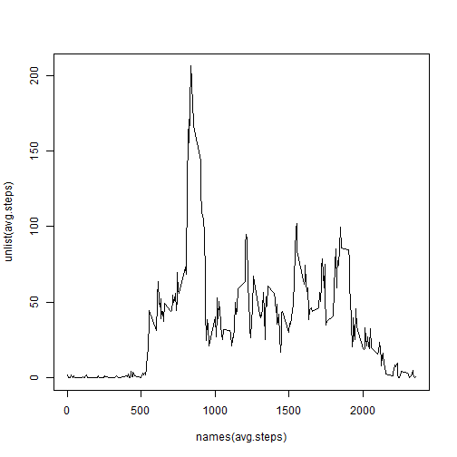
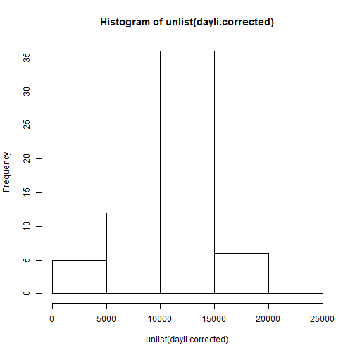
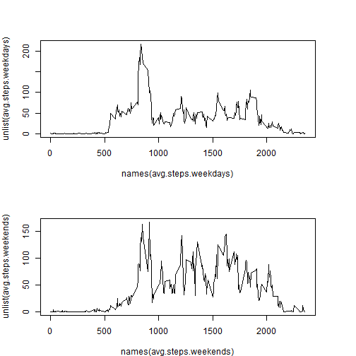

Reproducible Research: Peer Assessment 1
=================================================
#Korkosh Viacheslav

## Loading and preprocessing the data


```r
data <- read.csv('activity.csv')
clean.data <- data[!is.na(data$steps), ]
```
## What is mean total number of steps taken per day?

```r
dayli <- lapply(split(clean.data$steps, clean.data$date), sum)
mean(unlist(dayli))
```

```
## [1] 9354
```

```r
median(unlist(dayli))
```

```
## [1] 10395
```

## What is the average daily activity pattern?


```r
avg.steps <- lapply(split(clean.data$steps, clean.data$interval), mean)
plot(names(avg.steps),unlist(avg.steps),  type='l')
```

 

## Imputing missing values


```r
nas <- table(is.na(data$steps))
names(nas) <- c('Present data', 'Missing data')
nas[2]
```

```
## Missing data 
##         2304
```

```r
data.corrected <- data
for(i in 1:nrow(data.corrected)){
    if(is.na(data.corrected[i, 1])){
        temp <- subset(data.corrected, data.corrected$interval==data.corrected[i,3])
        data.corrected[i, 1] <- mean(temp$steps, na.rm=TRUE)
    }
}

dayli.corrected <- lapply(split(data.corrected$steps, data.corrected$date), sum)
mean(unlist(dayli.corrected))
```

```
## [1] 10766
```

```r
median(unlist(dayli.corrected))
```

```
## [1] 10766
```

```r
hist(unlist(dayli.corrected))
```

 

## Are there differences in activity patterns between weekdays and weekends?


```r
data.corrected$date <- as.Date(data.corrected$date, format='%Y-%m-%d')

daytype <- gl(2, nrow(data.corrected), labels=c('weekend', 'weekday'))
for(i in 1:nrow(data.corrected)){
    if(weekdays(data.corrected[i, 2])=='суббота' | weekdays(data.corrected[i, 2])=='воскресенье'){daytype[i] <- as.factor('weekend')}
    else{daytype[i] <- as.factor('weekday')}
}

data.corrected <- cbind(data.corrected, daytype)
data.weekdays <- subset(data.corrected, data.corrected$daytype=='weekday')
data.weekends <- subset(data.corrected, data.corrected$daytype=='weekend')
avg.steps.weekdays <- lapply(split(data.weekdays$steps, data.weekdays$interval), mean)
avg.steps.weekends <- lapply(split(data.weekends$steps, data.weekends$interval), mean)
par(mfrow=c(2,1), mar=c(4,4,4,4))
plot(names(avg.steps.weekdays),unlist(avg.steps.weekdays),  type='l')
plot(names(avg.steps.weekends),unlist(avg.steps.weekends),  type='l')
```

 
